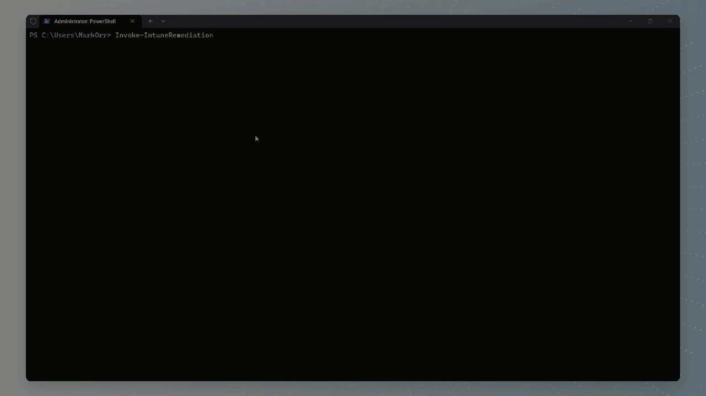

# IROD - Intune Remediation On Demand

A PowerShell tool to trigger Intune Proactive Remediation scripts on demand. Supports single device mode, multi-device GUI selection, and bulk file import. Connects to Microsoft Graph using least-privileged permissions and provides real-time progress tracking for batch remediation operations.

## See It in Action



## Features

- **Single Device Mode** - Run remediation on a specific device by name
- **Multi-Device Mode** - Select multiple devices via WPF GUI with:
  - Pagination for large device lists (50 devices per page)
  - Search/filter functionality across device names and users
  - Checkbox selection with count display
  - Select all/deselect all options
  - Real-time progress tracking window
  - Parallel execution for large batches (50+ devices)
- **Group Targeting** - Target all Windows devices in an Entra ID security group:
  - Supports both assigned and dynamic security groups
  - Includes devices from nested groups (transitive members)
  - Displays device count before execution
  - Matches Entra ID devices to Intune managed devices automatically
- **Import from File** - Load device names from CSV or TXT files for bulk operations
- **Export Results** - Export remediation results (detection state, script output, errors) to CSV
- **View History** - Track past remediations with 30-day retention and CSV export
- **Script Preview** - View detection and remediation code before selecting a script
- **Favorite Scripts** - Star frequently used scripts for quick access
- **Theme Support** - Choose Dark or Light UI theme (prompted on first run)
- **Automatic Module Installation** - Checks and installs required PowerShell modules automatically
- **Least-Privileged Permissions** - Uses only the minimum required Microsoft Graph scopes
- **Device Sync** - Automatically initiates device sync after triggering remediation
- **Windows Devices Only** - Filters to show only Windows devices (since remediation scripts only apply to Windows)
- **Interactive Help** - Built-in documentation accessible from the main menu

## Prerequisites

- PowerShell 5.1 or later
- Microsoft.Graph.Authentication module (auto-installed if missing)

The tool will automatically check for and install required modules on first run. To manually install:

```powershell
Install-Module Microsoft.Graph.Authentication -Scope CurrentUser
```

## Required Permissions

| Permission | Purpose |
|------------|---------|
| `DeviceManagementConfiguration.Read.All` | Read remediation scripts |
| `DeviceManagementManagedDevices.Read.All` | List and search devices |
| `DeviceManagementManagedDevices.PrivilegedOperations.All` | Trigger remediation and sync |
| `Group.Read.All` | Read Entra ID groups for group targeting |

## Installation

### Option 1: PowerShell Gallery (Recommended)

```powershell
Install-Module -Name IROD -Scope CurrentUser
Import-Module IROD
```

### Option 2: Manual Installation

1. Clone or download this repository
2. Import the module:
```powershell
Import-Module .\IROD\IROD.psd1
```

### Option 3: Use as Standalone Script (Backward Compatibility)

```powershell
.\IROD.ps1
```

## Usage

### Using the Module (Recommended)

**Interactive Mode:**
```powershell
Import-Module .\IROD\IROD.psd1
Invoke-IntuneRemediation
```

**Single Device Mode:**
```powershell
Invoke-IntuneRemediation -DeviceName "DESKTOP-ABC123"
```

**Multi-Device Mode:**
```powershell
Invoke-IntuneRemediation -MultiDevice
```

**Group Targeting Mode:**
```powershell
# Interactive menu will include option [3] Group
# Select a security group to target all its Windows devices
Invoke-IntuneRemediation
```

**Export Results to CSV:**
```powershell
Invoke-IntuneRemediation -ExportResults
```

**With Tenant ID:**
```powershell
Invoke-IntuneRemediation -TenantId "your-tenant-id"
```

**Get Help:**
```powershell
Invoke-IntuneRemediation -Help
```

### Using as Standalone Script (Backward Compatibility)

**Interactive Mode:**
```powershell
.\IROD.ps1
```

**Single Device Mode:**
```powershell
.\IROD.ps1 -DeviceName "DESKTOP-ABC123"
```

**Multi-Device Mode:**
```powershell
.\IROD.ps1 -MultiDevice
```

### Parameters

| Parameter | Description |
|-----------|-------------|
| `-DeviceName` | Name of a specific device to run remediation on |
| `-MultiDevice` | Switch to enable multi-device selection GUI |
| `-ExportResults` | Switch to export remediation results to CSV |
| `-ClientId` | Client ID of custom app registration (or set via `Configure-IROD`) |
| `-TenantId` | Tenant ID for custom app registration (or set via `Configure-IROD`) |
| `-Help` | Display detailed help information and exit |

### Exporting Remediation Results (Standalone Cmdlet)

`Get-IntuneRemediationResults` is available as a standalone cmdlet for scripting scenarios where you want to pull results without the interactive IROD workflow:

```powershell
# Export results for a specific remediation script
Get-IntuneRemediationResults -RemediationName "Fix Disk Space" -CsvPath "C:\Reports\remediation.csv"

# List available scripts and prompt for selection
Get-IntuneRemediationResults -CsvPath ".\results.csv"
```

The exported CSV includes: `DeviceName`, `UserPrincipalName`, `DetectionState`, `LastStateUpdateDateTime`, `PreRemediationDetectionScriptOutput`, `RemediationState`, `PostRemediationDetectionScriptOutput`, `RemediationScriptErrorDetails`, `DetectionScriptErrorDetails`.

## Configuration

### Custom App Registration

Instead of using parameters every time, you can configure IROD to use your custom app registration:

```powershell
Configure-IROD
```

**Example output:**
```
[ I R O D ]

This will configure your custom app registration for IROD.
These settings will be saved as user-level environment variables.

Enter your App Registration Client ID: abc123-def4-5678-90ab-cdef12345678
Enter your Tenant ID: xyz789-abc1-2345-67de-f89012345678

Configuration saved successfully!
You can now run Invoke-IntuneRemediation without parameters.
```

After configuration, just run:

```powershell
Invoke-IntuneRemediation
```

**To clear the configuration:**
```powershell
Clear-IRODConfig
```

### App Registration Requirements

Your custom app registration must have:
- **Platform**: Mobile and desktop applications
- **Redirect URI**: http://localhost
- **Allow public client flows**: Yes
- **API Permissions** (delegated):
  - `DeviceManagementConfiguration.Read.All`
  - `DeviceManagementManagedDevices.Read.All`
  - `DeviceManagementManagedDevices.PrivilegedOperations.All`

### Theme

On first run, IROD prompts you to choose a Dark or Light theme. To change your theme later:

```powershell
Set-IRODTheme -Theme 'Dark'   # or 'Light'
```

### Automatic Update Checking

IROD automatically checks for updates once every 24 hours when you run it. If an update is available, you'll be prompted to update.

**To disable update checks:**
```powershell
$env:IROD_DISABLE_UPDATE_CHECK = 'true'
```

## How It Works

1. Select execution mode from the interactive menu (or pass a parameter directly)
2. Authenticate to Microsoft Graph
3. Select a remediation script from your Intune tenant (with optional preview and favorites)
4. Select target device(s)
5. Confirm and execute
6. View real-time progress (multi-device mode)

## Interface

### Mode Selection
When running without parameters, you'll see:
```
[ I R O D ]  v1.0.4

  [1] Single Device
      Run remediation on one specific device

  [2] Multi-Device
      Select multiple devices via GUI

  [3] Group
      Target devices in an Entra ID security group

  [4] Import from File
      Load device names from CSV or TXT file

  [5] Export Results
      Export remediation results to CSV

  [6] View History
      View recent remediation history

  [H] Help
      View documentation and tips

  [Q] Quit

Enter choice (1-6, H, or Q):
```

### Group Targeting
Option [3] displays a GUI to select an Entra ID security group:
- Shows all security-enabled groups in your tenant
- Supports both **Assigned** and **Dynamic** groups
- Displays group type and description
- Shows total device count before execution
- Automatically resolves devices from nested groups (transitive membership)
- Only includes Windows devices managed by Intune

The tool matches Entra ID group members against Intune managed devices using the Entra ID Device ID.

### Import from File
Option [4] opens a file picker dialog. Supported formats:
- **CSV** - with a column named `DeviceName`, `Name`, `ComputerName`, or `Device`
- **TXT** - one device name per line

You can also export a template CSV to fill in:
```
  [1] Import from CSV
  [2] Export template CSV
```

### Multi-Device WPF GUI Features
- Device grid with pagination (50 devices per page)
- Live search/filter functionality
- Checkbox selection with counter
- Select All on Page / Deselect All buttons
- **Select All Devices** requires typing a confirmation phrase to prevent accidents
- Exit Tool button for clean exit at any stage
- Real-time progress tracking window during execution

### Script Selection GUI Features
- Sortable grid of all remediation scripts
- **Preview** - view the detection and remediation script code
- **Favorites** - star scripts you use frequently; favorites appear at the top
- Tooltip showing script description on hover

### History
Option [6] shows your last 20 remediations. From this view you can export the full history to CSV:
```
  [E] Export history to CSV
  [Enter] Return to menu
```

History is stored at `C:\Windows\Temp\IROD_history.json` with a 30-day retention window.

## Data Files

| File | Purpose |
|------|---------|
| `%APPDATA%\IROD\settings.json` | Theme and other user settings |
| `%APPDATA%\IROD\favorites.json` | Favorited remediation script IDs |
| `C:\Windows\Temp\IROD_history.json` | Remediation history (30-day retention) |

## License

MIT License
